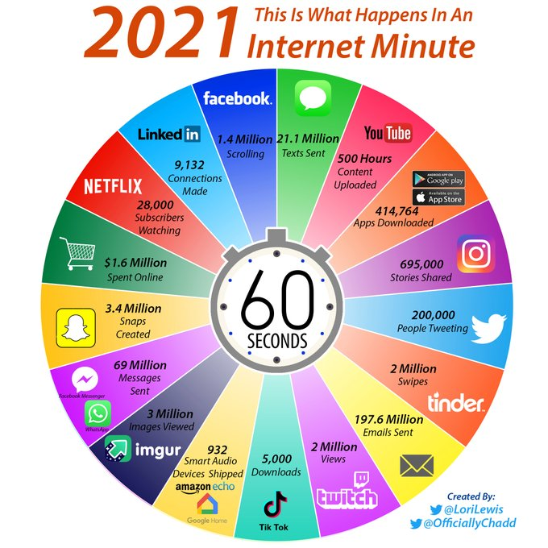

```{r xaringan-panelset, echo=FALSE}
xaringanExtra::use_panelset()
xaringanExtra::use_scribble()
xaringanExtra::use_tachyons()
```

class: middle

.pull-left[
.center[
## Estrutura
] 

- Software R 

- Pacotes necessários

- Base de dados

- Conceitos básicos

- Ambiente spark no RStudio

- Aplicação

- Atividade
 
]

.pull-right[


]

---
class: middle, center, inverse

#Software R


---
class: middle

.center[
# Software R 
]

.pull-left[

- Linguagem de programação de alto nível;

- Desenvolvido na década de 90 no departamento de Estatística da Universidade de Auckland, Nova Zelândia;

- Ross Ihaka e Robert Gentleman;

- As contribuições são feitas através de pacotes.
]

.pull-right[


]

---
class: middle

.center[
# Software R 
]

.pull-left[

- Rstudio é uma interface gráfica de usuário;
 
- É mais bonitinho `r emo::ji("smile")`.
]

.pull-right[


]

---
class: middle
.center[
# Software R 
]

- Instalar o [RStudio](https://www.rstudio.com/products/rstudio/download/)

  -  Necessita do [R](https://cran.fiocruz.br/) instalado

```{r message=FALSE, warning=FALSE, paged.print=FALSE}
sessioninfo::session_info()$platform
```

---
class: middle, center, inverse

#Pacotes necessários

---
class: middle

.center[
# Pacotes necessários
]


- Pacotes para conexão com Sparklyr e manipulação dos dados 

  - Sparklyr
  
  - dplyr
  
```{r message=FALSE, warning=FALSE, paged.print=FALSE}
#install.packages("sparklyr")
require(sparklyr)
packageVersion("sparklyr")
#install.packages("dplyr")
require(dplyr)
packageVersion("dplyr")
```


---
class: middle

.center[
# Pacotes necessários
]

- Pacotes para visualização de dados 

  - ggplot2
  
  - dbplot
  
```{r message=FALSE, warning=FALSE, paged.print=FALSE}
#install.packages("ggplot2")
require(ggplot2)
packageVersion("ggplot2")
#install.packages("dbplot")
require(dbplot)
packageVersion("dbplot")
```

---
class: middle, center, inverse

# Base de dados

---
class: middle

.center[
# Iris
]

-  O conjunto de dados Iris contém quatro características (comprimento e largura das sépalas e pétalas) de 50 amostras de três espécies de Iris (Iris setosa, Iris virginica e Iris versicolor)

- Essas medidas foram usadas para criar um modelo discriminante linear para classificar as espécies.

---
class: middle

.center[
# Iris
]


---
class: middle

.center[
# Iris
]

- As variáveis são 
  
  1. Sepal.Length: Comprimento da sépala em cm
  
  2. Sepal.Width: Largura da sépala em cm
  
  3. Petal.Length: Comprimento da pétala em cm
  
  4. Petal.Width: Largura da pétala em cm
  
  5. Species: classe
  
       - Iris Setosa
    
       - Iris Versicolour
    
       - Iris Virginica

---
class: middle, center, inverse

# Conceitos básicos

---
class: middle

.center[
# O que são grandes bases de dados?
]

- Big data são conjuntos de dados tão grandes e complexos que softwares tradicionais de processamento de dados são inadequados para manuseá-los ou analisá-los, (Zgurovsky e Zaychenko, 2020).

- As principais características:

    - Grande volume
    
    - Alta velocidade
    
    - Grande variedade
    
- [Fifty-Six Big Data V’s Characteristics and Proposed Strategies to Overcome Security and Privacy Challenges (BD2)](https://www.scirp.org/journal/paperinformation.aspx?paperid=103823)    


---
class: middle

.center[
# Analógico vs Digital
]

```{r, echo=FALSE, out.width="100%", fig.align='center', fig.cap="Capacidade mundial de armazenar informações"}
knitr::include_graphics("analogico_digital.png")
```

---
class: middle

.center[
# História
]

- Em 2003 o Google apresentou uma abordagem que ficou conhecida com **Google File System**;

- Um ano depois lançou uma outra abordagem chamada **MapReduce** com duas operações, mapear e reduzir;

- As duas operações são sufientes para processar todos os dados disponíveis na web.

- Com o tempo para trabalhar com big data, foram implementadas ferramentas específicas como Hadoop, HBase e Mongo DB;

---
class: middle

.center[
# Hadoop
]

- Depois que esses artigos foram lançados pelo Google, uma equipe do **Yahoo** trabalhou na implementação do **Google File System** e do **MapReduce** como um único projeto de código aberto;

- Este projeto foi lançado em 2006 como **Hadoop**, com o Google File System implementado ficou conhecido como **Hadoop Distributed File System (HDFS)**;

- O projeto Hadoop tornou a computação baseada em arquivo distribuída acessível a uma ampla gama de usuários e organizações, tornando o MapReduce útil além do processamento de dados da web;

- Em 2008 por meio do projeto **Hive** trouxe o suporte a **Structured Query Language (SQL)** para o **Hadoop**

---
class: middle

.center[
# Spark
]

- Foi criado em 2009 por causa das limitações das abordagens **MapReduce** e **HDFS**;

- O **Spark** usa o Hadoop de duas maneiras - uma é o **armazenamento** e a segunda é o **processamento**;

- Em 2013 foi doado para a **Apache Software Foundation**;

- Recursos do Apache Spark:

  - Velocidade: 100x mais rápido na memória e 10x mais rápido quando executado no disco em relação ao Hadoop;
  
  - Suporta várias linguagens: Suporta API integradas em Java, Scala, Python e R;
  
  - Análise avançada: Consultas SQL, aprendizado de máquina, gráficos e dados de streaming. 

---
class: middle

.center[
# Informação por minuto
]

```{r, echo=FALSE, out.width="70%", fig.align='center'}

```


---
class: middle

.center[
# O que são grandes bases de dados?
]

```{r, echo=FALSE, out.width="60%", fig.align='center'}

```

---
class: middle

.center[
# Pacote Sparklyr
]

- O `sparklyr` é uma interface R para o Apache Spark, fornece um back-end compatível com `dplyr`;

- Alguns destaques:
  
  - Filtra e agrega conjuntos de dados do Spark e, em seguida, importa para o R para análise e visualização;

  - Usa a biblioteca de aprendizado de máquina distribuída do Spark no R [MLlib](https://spark.rstudio.com/mlib/);
  
  - Cria extensões que chama a API Spark completa e fornece interfaces para pacotes Spark.


---
class: middle

.center[
# back-end compatível com dplyr?
]

- Quando conectado a um Spark DataFrame, dplyr converte os comandos em instruções SQL do Spark.

```{r echo=FALSE}
verbo_dplyr <- c("select", "filter", "arrange", "summarise", "mutate")
verbo_sql <- c("SELECT", "WHERE", "ORDER", "sum, min, sd, etc", "+, *, log, etc.")

cbind("dplyr" = verbo_dplyr, "SQL" =verbo_sql) %>% 
  knitr::kable()
```

- Livro do Curso R sobre o [dplyr](https://livro.curso-r.com/7-2-dplyr.html)

---
class: middle, center, inverse

# Ambiente spark no RStudio

---
class: middle

.center[
# Primeiros passos
]

- Instalar o spark no computador

  - Verificar se já tem 
  
```{r message=FALSE, warning=FALSE, paged.print=FALSE}
spark_installed_versions()
```
  

---
class: middle

.center[
# Primeiros passos
]

- Instalar o spark no computador

  - Verificar a versão disponível
  
```{r message=FALSE, warning=FALSE, paged.print=FALSE}
spark_available_versions()
```
  
---
class: middle

.center[
# Primeiros passos
]

- Instalar o spark no computador

  - Pegar a versão mais atual

```{r eval=FALSE, include=TRUE}
spark_install("3.1")
```

---
class: middle, center, inverse


---
class: middle

.center[
# Conexão Spark
]

- Função `spark_connect`

  - `master`: Local de conexão spark; 
  
  - `version`: Versão utilizada;
  
  - `config`: Configurações extras.
  
- Mais informações [1](https://spark.rstudio.com/guides/connections/), [2](https://spark.rstudio.com/deployment/) e [3](https://therinspark.com/tuning.html).


---
class: middle

.center[
# "Lendo" os dados
]

- `spark_read_csv`: lê um arquivo CSV;

- `spark_read_json`: lê um arquivo JSON;

- `spark_read_parquet`: lê um arquivo em parquet;

---
class: middle

.center[
# "Lendo" os dados - Dica`r emo::ji("gold")`
]

- Um arquivo muito grande que contêm muitas colunas;

- Sabendo as colunas necessárias para a análise;

- Utiliza o comando `memory = FALSE` e depois seleciona as colunas;

- E armazena na memória utilizando a função `compute()`. 

---
class: middle

.center[
# Escrevendo os dados
]

- `spark_write_csv`: Escreve o arquivo CSV;

- `spark_write_json`: Escreve o arquivo JSON;

- `spark_write_parquet`: Escreve o arquivo em parquet. 

---
class: middle

.center[
# Escrevendo os dados - Dica`r emo::ji("gold")`
]

- O spark "quebra" seus dados em partições para a leitura e manipulação;

- Quando escreve direto salva inúmeras partições;

- Para colar as partições utiliza a função `sdf_coalesce()`.

---
class: middle

.center[
# Atividade
]

Base de dados, [Microdados do Enem 2019](https://www.gov.br/inep/pt-br/acesso-a-informacao/dados-abertos/microdados/enem)


1. Ler o arquivo em .csv e salvar em um único arquivo parquet

2. Elaborar um gráfico utilizando o pacote `ggplot2`

3. Elaborar um gráfico utilizando o pacote `dbplot`

4. Fazer uma tabela resumo das variáveis de notas.

---
class: middle

.center[
# Referências e `help`
]

- [spark.rstudio](https://spark.rstudio.com/)

- [Mastering Spark with R](https://therinspark.com/index.html)

- [Apache Spark](http://spark.apache.org/)

- [sparklyr: R Interface to Apache Spark](https://cran.r-project.org/web/packages/sparklyr/index.html)

